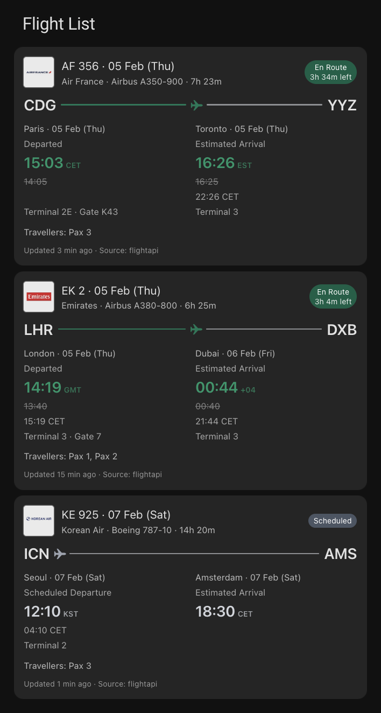
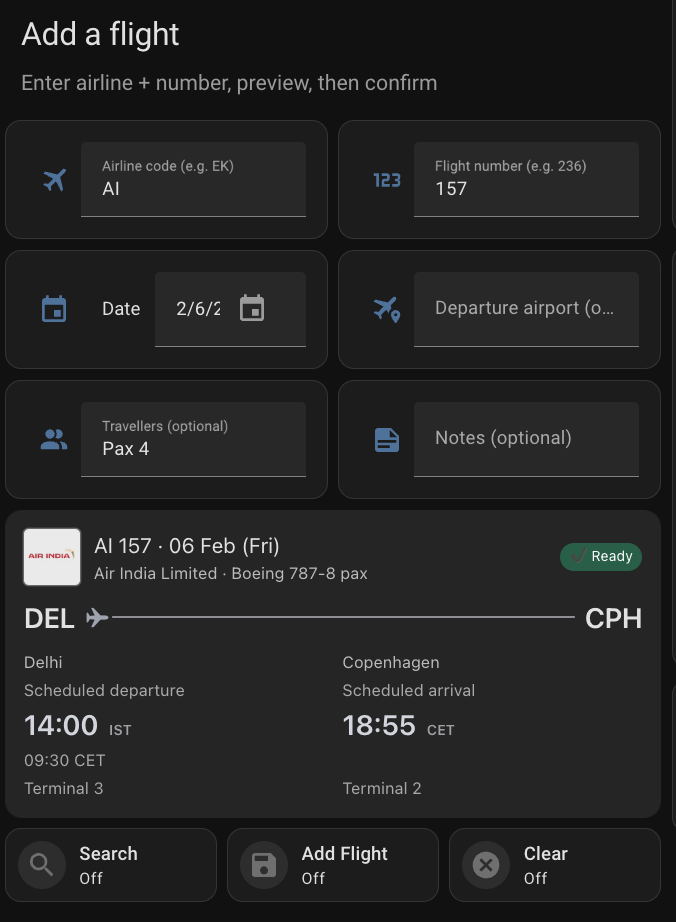

# Flight Status Tracker (Home Assistant)

Flight Status Tracker is a Home Assistant integration that tracks upcoming flights and their status.
It lets you preview a flight before saving it and then keeps status updated with smart polling.

## Privacy & Data Handling

Flight Status Tracker is **per-user and BYO-API-keys**. It does **not** operate any shared backend.
Status and schedule lookups are performed directly from your Home Assistant instance to the configured
provider APIs using your own keys.

## Installation

### HACS (Custom Repository)
1. HACS > three-dot menu > **Custom repositories**
2. Add this repo URL and select **Integration**
3. Install **Flight Status Tracker** and restart Home Assistant
4. Add the integration in **Settings > Devices & Services**

### Manual (advanced)
1. Copy `custom_components/flight_status_tracker` into your HA config:
   - `/config/custom_components/flight_status_tracker`
2. Restart Home Assistant
3. Add the integration in **Settings > Devices & Services**

## Getting Started

1) Configure the integration (API keys/providers) under **Settings > Devices & Services**.

2) Use either:
- **Simple dashboard**: add entities directly (Entities card is fine).
- **Example Lovelace YAML**: copy/paste the example cards from `docs/lovelace/`.

Core entities:
- Inputs: `text.flight_status_tracker_add_flight_airline`, `text.flight_status_tracker_add_flight_number`, `date.flight_status_tracker_add_flight_date`,
  `text.flight_status_tracker_add_flight_dep_airport`, `text.flight_status_tracker_add_flight_travellers`, `text.flight_status_tracker_add_flight_notes`
- Actions: `button.flight_status_tracker_preview_from_inputs`, `button.flight_status_tracker_confirm_add_preview`, `button.flight_status_tracker_clear_preview`
- Flight list: `sensor.flight_status_tracker_upcoming_flights`

## Configuration Notes

- **Schedule provider** is used for preview/add (must return scheduled times).
- **Status provider** is used for live status updates.
- Provider timestamps are normalized to UTC internally.

## Services

- `flight_status_tracker.preview_flight`: build a server-side preview from minimal inputs
- `flight_status_tracker.confirm_add`: save the current preview into manual flights
- `flight_status_tracker.clear_preview`: clear preview
- `flight_status_tracker.refresh_now`: force an immediate rebuild/refresh
- `flight_status_tracker.prune_landed`: remove arrived/cancelled flights older than cutoff

## Storage Keys

These files live under `/config/.storage/`:
- `flight_status_tracker.manual_flights`
- `flight_status_tracker.add_preview`
- `flight_status_tracker.ui_inputs`
- `flight_status_tracker.directory_cache`

## Uninstall / Cleanup

1) Remove the integration: **Settings > Devices & Services > Flight Status Tracker > Remove**
2) Remove files:
   - If installed via HACS: uninstall in **HACS > Integrations**
   - If installed manually: delete `/config/custom_components/flight_status_tracker/`
3) (Optional) Remove stored data: delete the storage key files listed above and restart Home Assistant

## Lovelace

Example Lovelace cards are provided under `docs/lovelace/`:
- `docs/lovelace/flight_list.yaml`
- `docs/lovelace/add_preview_flight.yaml`
- `docs/lovelace/remove_flight.yaml`
- `docs/lovelace/diagnostics.yaml`

These examples use optional custom frontend cards (install via **HACS > Frontend**):
- `Mushroom` (`custom:mushroom-*`)
- `Auto-Entities` (`custom:auto-entities`)
- `TailwindCSS Template Card` (`custom:tailwindcss-template-card`)

If a card is not listed in HACS, add its GitHub repo under **HACS > Frontend > Custom repositories**.
