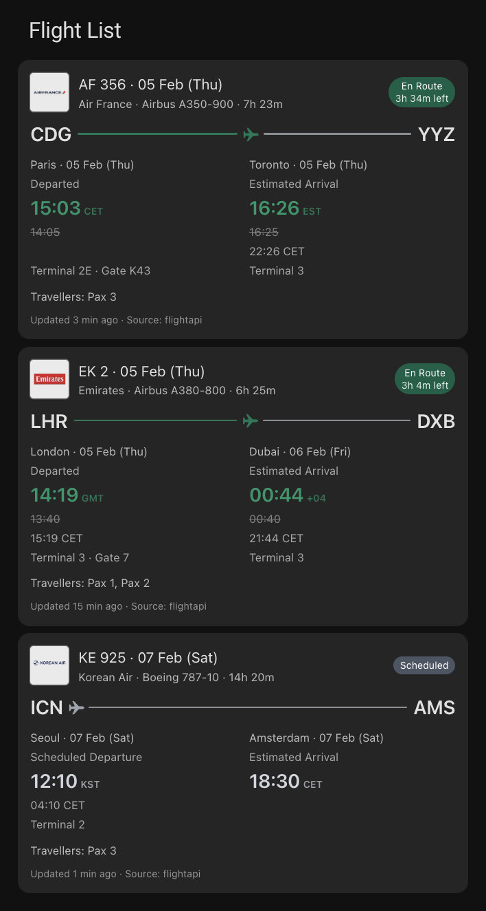
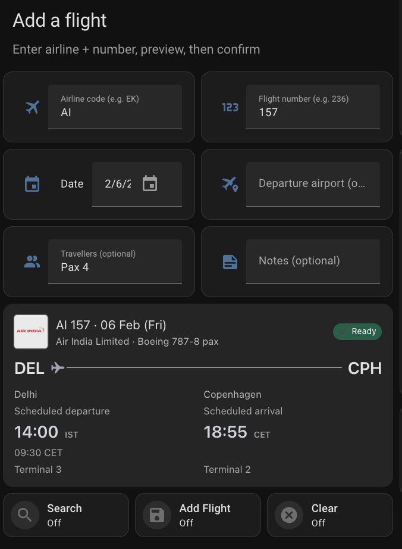

# Flight Status Tracker (Home Assistant)

> This project was created with the assistance of OpenAI Codex.

Flight Status Tracker is a Home Assistant integration that tracks upcoming flights and their status.
It lets you preview a flight before saving it and then keeps status updated with smart polling.

## Privacy & Data Handling

Flight Status Tracker is **per-user and BYO-API-keys**. It does **not** operate any shared backend.
Status and schedule lookups are performed directly from your Home Assistant instance to the configured
provider APIs using your own keys.

The integration stores your manual flights (and any optional travellers/notes you add) locally in your
Home Assistant storage. It does not send travellers/notes to providers.

## Disclaimer

- This is an unofficial, community integration. It is not affiliated with any airline or provider.
- Flight data can be incomplete, delayed, or incorrect depending on provider quality and rate limits.
- Use this as an informational aid, not as an operational source for travel decisions.

## Installation

### HACS (Custom Repository)
1. HACS > three-dot menu > **Custom repositories**
2. Add this repo URL and select **Integration**
3. Install **Flight Status Tracker** and restart Home Assistant
4. Add the integration in **Settings > Devices & Services**

### Manual (advanced)
1. Copy `custom_components/flight_status_tracker` into your HA config:
   - `/config/custom_components/flight_status_tracker`
2. Restart Home Assistant
3. Add the integration in **Settings > Devices & Services**

## Getting Started

1) Configure the integration (API keys/providers) under **Settings > Devices & Services**.

2) Use either:
- **Simple dashboard**: add entities directly (Entities card is fine).
- **Custom cards (recommended)**: install **Flight Status Tracker Cards** from `https://github.com/tubloo/hacs-flight-status-cards` and add the four cards directly.
- **Example Lovelace YAML**: copy/paste the example cards from `docs/lovelace/`.

Core entities:
- Inputs: `text.flight_status_tracker_add_flight_airline`, `text.flight_status_tracker_add_flight_number`, `date.flight_status_tracker_add_flight_date`,
  `text.flight_status_tracker_add_flight_dep_airport`, `text.flight_status_tracker_add_flight_travellers`, `text.flight_status_tracker_add_flight_notes`
- Actions: `button.flight_status_tracker_preview_from_inputs`, `button.flight_status_tracker_confirm_add_preview`, `button.flight_status_tracker_clear_preview`
- Flight list summary: `sensor.flight_status_tracker_upcoming_flights`
- Per-flight entities: dynamic `sensor.*` entities with attribute `flight_key` (entity_id can vary)
- Maintenance: `button.flight_status_tracker_refresh_now`, `button.flight_status_tracker_remove_landed`, `button.flight_status_tracker_refresh_directory` (entity_id may vary)

Workflow: set airline + number + date -> press **Search/Preview** -> press **Add Flight**.

For a detailed walkthrough and troubleshooting, see `docs/guide.md`.

## Configuration Notes

- **Schedule provider** is used for preview/add (must return scheduled times).
- Schedule lookup is **strict**: only the selected schedule provider is used (no cross-provider fallback).
- **Status provider** is used for live status updates.
- Provider timestamps are normalized to UTC internally.
- **Position provider** is optional and is disabled by default.
- Airport/airline directory enrichment is handled internally using data files and cached locally (refresh ~monthly).
- You can force a directory refresh anytime via `button.flight_status_tracker_refresh_directory` (your entity_id may vary; check Developer Tools).
- Status updates use a configurable **time-based polling schedule** (Far-Future, Prepare to Travel, Take Off, Mid Flight, Landing, and Post Arrival windows).

## Defaults (when Options are untouched)

If you never open the Options UI, Home Assistant can keep `entry.options` empty. The integration still
uses sensible defaults:
- Include past hours: `24`
- Days ahead: `120`
- Auto-remove past flights: `true`
- Auto-remove flight (minutes after arrival): `60`
- Internal minimum API poll floor: `5` (not user-configurable)
- Position provider: `disabled`

## Services

- `flight_status_tracker.preview_flight`: build a server-side preview from minimal inputs
- `flight_status_tracker.confirm_add`: save the current preview into manual flights
- `flight_status_tracker.clear_preview`: clear preview
- `flight_status_tracker.refresh_now`: force an immediate rebuild/refresh
- `flight_status_tracker.prune_landed`: remove arrived/cancelled flights older than cutoff (service parameter is `hours`)

## Storage Keys

These files live under `/config/.storage/`:
- `flight_status_tracker.manual_flights`
- `flight_status_tracker.add_preview`
- `flight_status_tracker.ui_inputs`
- `flight_status_tracker.directory_cache`

## Uninstall / Cleanup

1) Remove the integration: **Settings > Devices & Services > Flight Status Tracker > Remove**
2) Remove files:
   - If installed via HACS: uninstall in **HACS > Integrations**
   - If installed manually: delete `/config/custom_components/flight_status_tracker/`
3) (Optional) Remove stored data: delete the storage key files listed above and restart Home Assistant

## Lovelace

Recommended dashboard package:
- **Flight Status Tracker Cards repo**: `https://github.com/tubloo/hacs-flight-status-cards`
- Card types:
  - `custom:flight-status-tracker-list-card`
  - `custom:flight-status-tracker-add-card`
  - `custom:flight-status-tracker-remove-card`
  - `custom:flight-status-tracker-diagnostics-card`

Example Lovelace cards are provided under `docs/lovelace/`:
- `docs/lovelace/flight_list.yaml`
- `docs/lovelace/add_preview_flight.yaml`
- `docs/lovelace/remove_flight.yaml`
- `docs/lovelace/diagnostics.yaml`

These examples use optional custom frontend cards (install via **HACS > Frontend**):
- `Mushroom` (`custom:mushroom-*`)
- `Auto-Entities` (`custom:auto-entities`)
- `TailwindCSS Template Card` (`custom:tailwindcss-template-card`)

If a card is not listed in HACS, add its GitHub repo under **HACS > Frontend > Custom repositories**.

## Troubleshooting

- Arrived flight still showing:
  - Auto-remove only applies to `Arrived/Cancelled/Landed` and only after the configured cutoff.
  - Press `button.flight_status_tracker_refresh_now` to rebuild now.
  - Press `button.flight_status_tracker_remove_landed` (or call `flight_status_tracker.prune_landed`) to prune immediately.
- Preview shows nothing:
  - Check `sensor.flight_status_tracker_add_preview` attribute `preview` in Developer Tools -> States.
  - Ensure the schedule provider is configured and has a valid API key.
  - Schedule lookup does not fail over to another provider. If your selected schedule provider has no record for that date/flight, preview will stay `no_match`.
  
## Upgrade Notes

- `v2.1.0`: Provider model simplified to supported providers (`aerodatabox`, `flightapi`) with single-provider schedule selection, updated provider-first directory behavior/docs, and refreshed diagnostics/Lovelace documentation.
- `v2.0.2`: Refresh scheduling hardening. If smart per-flight scheduling yields no `next_refresh` while active flights still exist, a fallback refresh is now scheduled to keep updates alive. Also improves `status_updated_at` semantics so successful provider responses with usable signal fields advance the flight “last updated” timestamp.
- `v2.0.1`: Refresh reliability hardening. Status/position provider exceptions are now isolated per flight so one failing call does not break the full rebuild cycle, and scheduler retry handling is more defensive when replacing existing refresh callbacks.
- `v1.0.0`: Added scheduler watchdog self-healing and per-flight `ui` display block for faster dashboard templates. Watchdog adds diagnostics (`last_rebuild_at`, `next_refresh_at`, `watchdog_last_*`) and auto-kicks rebuild on stale scheduling state without forcing unnecessary API polls.
- `v1.0.1`: Polling windows simplified to Far-Future, Prepare to Travel, Take Off, Mid Flight, Landing, and Post Arrival. Prepare-to-Travel replaces previous mid/near pre-departure split. Take Off and Landing poll intervals now support a minimum of 1 minute.
- `v1.0.2`: Options UI moved to a step-based wizard (providers -> credentials -> polling -> list/cleanup -> review). `min_api_poll_minutes` removed from the wizard and fixed internally at 5 minutes.
- `v2.0.0`: Upcoming flights sensor now acts as a summary (`flights_total`, `flight_keys`) while each flight is exposed as a dynamic per-flight sensor with `flight_key` and full `flight` attributes. This is a breaking change: Lovelace/templates should read per-flight sensors rather than `sensor.flight_status_tracker_upcoming_flights` attribute `flights`.
